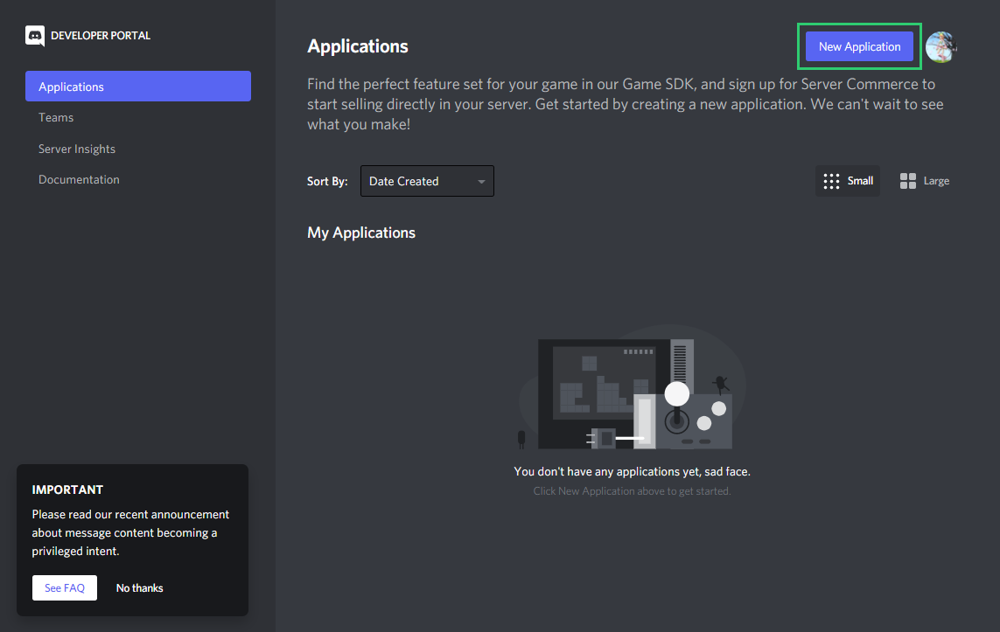
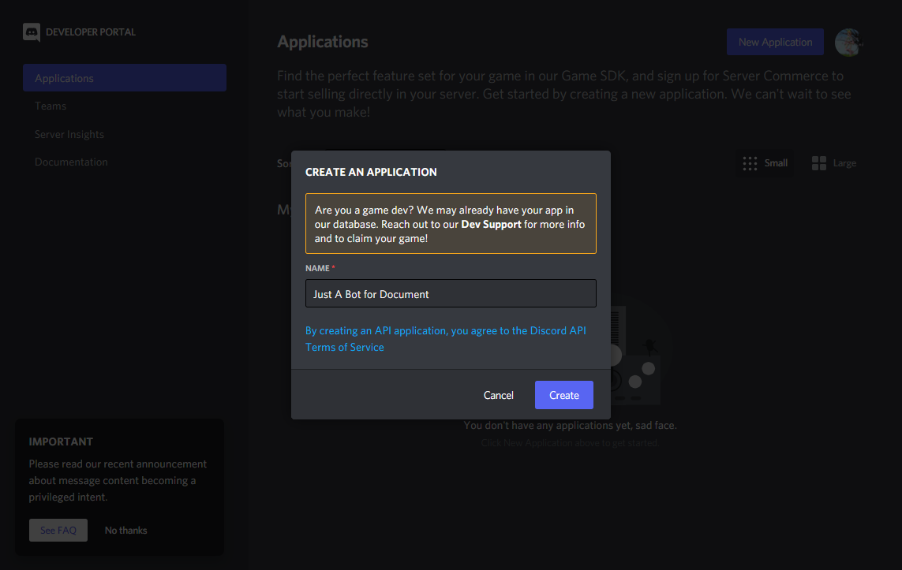
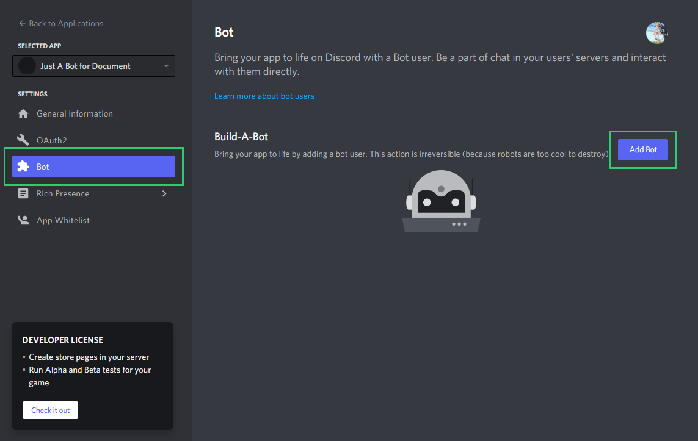
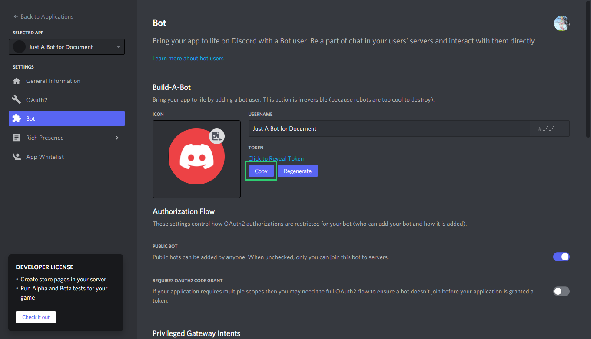
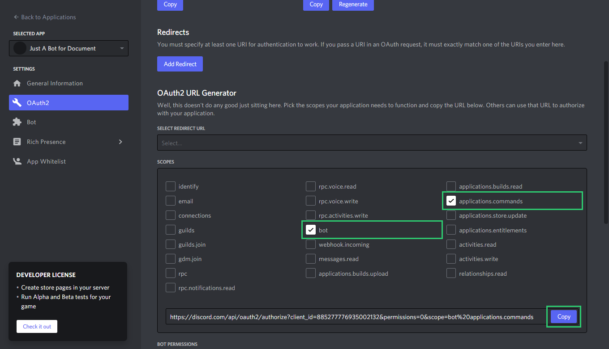
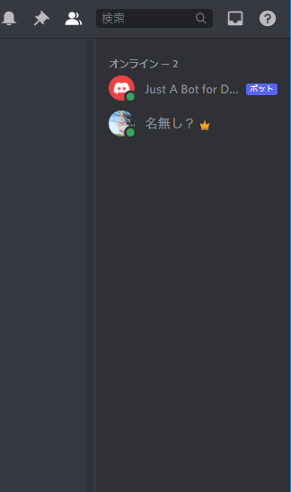
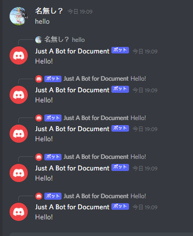
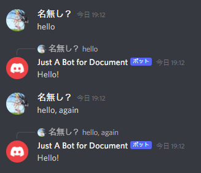

# @title Tutorial

# Tutorial

Welcome to discorb! This lib allows you to create a discord bot with ease. So, let's get started!

## Requirements

- Ruby 3.0.0+
- Basic knowledge of ruby  
    These documents will help you:
    - [Ruby in Twenty Minutes](https://www.ruby-lang.org/en/documentation/quickstart/)
    - [Ruby from other languages](https://www.ruby-lang.org/en/documentation/ruby-from-other-languages/)
    - [Try ruby!](https://try.ruby-lang.org/)

### Recommended

- Good editor  
    They are recommended:
    - [VSCode](https://code.visualstudio.com/)
    - [Atom](https://atom.io/)
    - [Sublime Text](https://www.sublimetext.com/)
    - [Brackets](https://brackets.io/)
    - [Notepad++](https://notepad-plus-plus.org/)
- Git
- Bundler

Once you have all of these, you can start coding!

## Start creating your bot

### Create a Bot account

You must have a bot account to use this lib. First, go to [Discord Developer Portal](https://discord.com/developers/applications) and click on `New Application`.  


And then type a name for your bot, and click `Create`.  


You will be redirected to the `General Information` page.
Then, click `Bot` and then `Add Bot` and then `Yes, do it!`.  


You will see bot information, and click `Copy` button in TOKEN section.  


**DO NOT SHARE THIS TOKEN, OR YOUR BOT BAN EVERYONE IN EVERY SERVER!**
This is serious security risk.

Click `Regenerate` button to regenerate your token. Do this immediately when you accidentally share your token.

You did it! Now, you have a bot account.

#### Invite your bot to a server

Go to `OAuth2` page and scroll down, and check `bot` and `applications.commands` permissions.  

Then, click `Copy` button and paste it to your browser.
Choose a server you want to invite your bot to, and follow the instructions.

### Code your bot

#### Install gems

Open terminal and type:

```
gem install bundler discorb
```

#### Setup files

Create a new directory and go to it.
Open terminal and type:

```
discorb init
```

Specify `--git` if you want to use git.

You will get some files in your directory.

- `main.rb`: The main file of your bot.
- `.env`: The environment variables of your bot. **You must keep this file secret!**
- `Gemfile`: Gemfile for bundler.
- `Gemfile.lock`: Gemfile.lock for bundler.

You will get other files if you specify `--git`.
{file:docs/cli/init.md Learn more here}.

#### Start your bot

Open `main.rb`, you will see the following code:

```ruby
require "discorb"
require "dotenv"

Dotenv.load  # Loads .env file

client = Discorb::Client.new  # Create client for connecting to Discord

client.once :standby do
  puts "Logged in as #{client.user}"  # Prints username of logged in user
end

client.run ENV["TOKEN"]  # Starts client
```

Open `.env`, you will see:

```
TOKEN=Y0urB0tT0k3nHer3.Th1sT0ken.W0ntWorkB3c4useItH4sM34n1ng
```

Replace `Y0urB0tT0k3nHer3.Th1sT0ken.W0ntWorkB3c4useItH4sM34n1ng` with your bot token.
Remember to keep this file secret!

Open terminal and type:

```sh
bundle exec ruby main.rb
# or
bundle exec discorb run main.rb
```

Yay! Your bot is online!  


But your bot won't do anything.
So add your bot some greetings!
`Ctrl + C` to stop your bot.

#### Add a greeting

You can do some action on message by typing like this:

```ruby
client.on :message do |message|
  # ...
end
```

`message` is a {Discorb::Message} object. It contains information about the message.
You can get the message content by {Discorb::Message#content}.
Add `if` statement, and reply to the message with {Discorb::Message#reply}.

```ruby
client.on :message do |message|
  if message.content.downcase.include? "hello"
    message.reply "Hello!"
  end
end
```

Save your bot and restart it.

You can see your bot's response by typing `hello` in your server...  



Oh no! Your bot is responding to bot's messages, and it doesn't stop!

Terminate your bot by typing `Ctrl + C` in terminal.

#### Ignore bot's messages

You can access author information by {Discorb::Message#author}, and it has {Discorb::User#bot?}.
So, you can ignore bot's messages by adding `if` statement:

```ruby
client.on :message do |message|
  next if message.author.bot?

  # ...
end
```

Note you must use `next` to exit the block.

Save your bot and start it.



You did it! Your bot won't respond to bot's messages anymore.

## Finally

This is the end of tutorial.

To learn more, check out the [documentation](https://discorb-lib.github.io/).

We hope you enjoy this lib! Thanks for reading!
